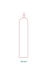
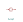
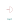
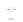

# PI&D KiCAD Symbols

## valve - general.svg

## flexible hose.svg

## vent - covered.svg

## bottle.svg

## back pressure regulator.svg

## valve - 3 way ball.svg

## valve - check.svg

## pressure transducer.svg

## valve - angle globe.svg

## burst disk - pressure.svg

## pump.svg

## valve - hydraulic.svg

## pressure regulator.svg

## valve - needle.svg

## valve - 3 way.svg

## valve - butterfly.svg

## engine - bipropellant.svg

## valve - 3 way globe.svg

## thermocouple.svg

## valve - servo.svg

## burst disk - vacuum.svg

## engine - hybrid.svg

## valve - pressure and vacuum relief.svg

## valve - pneumatic.svg

## engine - solid.svg

## quick disconnect - destination sealed.svg

## bottle - dip tube.svg

## pressure gauge.svg

## quick disconnect - no sealing.svg

## valve - angle ball.svg

## cap.svg

## filter.svg

## pressure indicator.svg

## valve - 4 way.svg

## valve - manual.svg

## quick disconnect - source sealed.svg

## quick disconnect - both sealed.svg

## filter - conical.svg

## vent - uncovered.svg

## valve - pressure relief.svg

## valve - non return.svg
